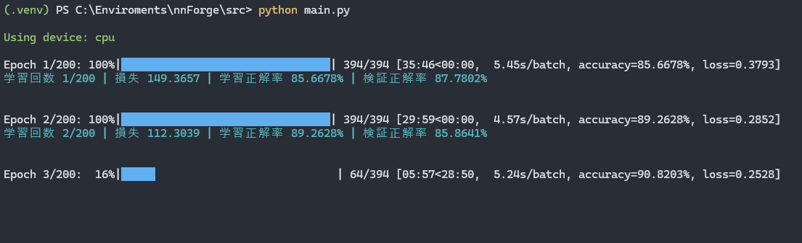
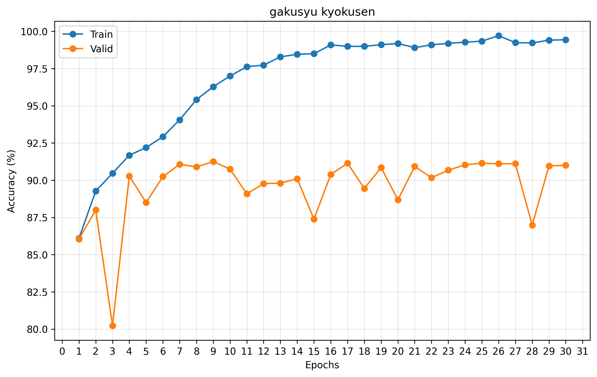
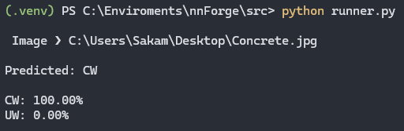
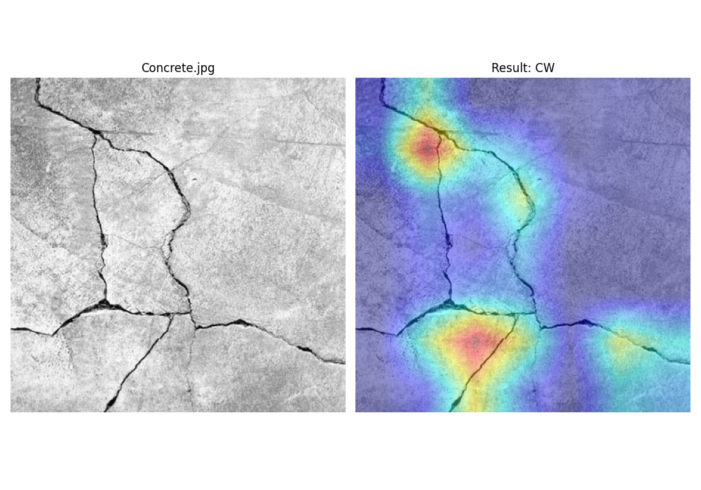

<div align="center">
    <h2>Neural Network Forge</h2>
    <p>画像解析・深層学習を行うための開発環境 🐉</p>
</div>

<a href="https://github.com/Sakamochanq/nnForge/actions">
    
</a>

<br>

<h3>概要</h3>

Neural Network Forge (以下 nnForge) は、私が研究で使用している画像解析・深層学習のための開発環境を保管しておくためのリポジトリです。
他者の環境での再現性を保証するものではありませんが、私の環境を共有することで、同様の環境を構築する際の参考になればと思います。このREADMEでは、
nnForgeの構成や使用方法について説明しています。これは後から自分で見たときに理解できるようにするためでもあります。


<br>
<br>

<h3>技術スタック</h3>

<div>
  <table>
    <thead>
      <tr>
        <th>項目</th>
        <th>技術</th>
      </tr>
    </thead>
    <tbody>
      <tr>
        <td>開発言語</td>
        <td>Python</td>
      </tr>
      <tr>
        <td>フレームワーク</td>
        <td>PyTorch / TensorFlow</td>
      </tr>
      <tr>
        <td>ソフトウェア</td>
        <td>VSCode / PowerShell</td>
      </tr>
      <tr>
        <td>その他のツール</td>
        <td>git / FFmpeg</td>
      </tr>
    </tbody>
  </table>
</div>

<br>
<br>

<h3>技術選定理由</h3>

<h4>【 開発言語 】</h4> 

**Python**は、機械学習や深層学習の分野で広く使用されている言語であり、豊富なライブラリとコミュニティサポートがあるため、
開発効率が高いと考えています。

<h4>【 フレームワーク 】</h4>

**PyTorch**は、直感的で柔軟なコード記法と情報の豊富さから、研究活動に適していると感じています。
Pythonの標準的なコードに近い感覚で動的に計算グラフを構築することができ、深層学習の実装やデバッグがスムーズに行えると感じます。
また、高い拡張性とカスタマイズ性があり、独自のニューラルネットワークを直感的に構築することが出来ます。さらに画像処理の`torchvision`や
音声処理`torchaudio`などのライブラリも充実しているため、画像解析や深層学習の研究に適している思い選定しました。

<h4>【 ソフトウェア 】</h4>

**VSCode**は、テキストエディタとして世界中で圧倒的なシェア率を誇っています。起動と動作が高速であり、統合開発環境（IDE）とは違い、数万行の巨大なファイルの編集も可能です。
また、豊富な拡張機能とカスタマイズ性があり、あらゆる言語に対応しています。テキストエディタ全体を自分好みにカスタマイズできる点で選定しました。

<br>
<br>

<h3>環境構築</h3>


1. Pythonのインストール

    以下のコマンドをターミナルで実行し、Python環境が正しくインストールされていることを確認してください。

    ```bash
    Python --version
    # Python 3.10.12
    ```

<br>

2. リポジトリのクローン

    以下のコマンドをターミナルで実行し、nnForgeリポジトリをクローンしてください。  
    gitがインストールされていない場合は、`Download Zip`から直接ダウンロードしてください。

    ```bash
    git clone https://github.com/Sakamochanq/nnForge.git
    cd nnForge
    ```

<br>

3. 仮想環境の構築と依存関係のインストール

    以下のコマンドをターミナルで実行し、仮想環境を構築し、必要な依存関係をインストールしてください。

    ```bash
    # 仮想環境の構築
    python -m venv .venv
    .venv\Scripts\activate

    # 依存関係のインストール
    pip install -r requirements.txt
    ```

<br>

4. 環境変数の設定

    こちらの開発環境では `SDNET2018` という、AIや機械学習の技術を使ってコンクリートのひび割れや欠陥を検出・分類する研究用画像データセットを使用しています。
    `./src/assets/dataset/SDNET2018` にデータセットを配置します。
    その他の環境変数は `./src/assets/config.py` に記載されているものを適宜変更します。

    ```py
    class config:
    
    # 学習させるデータセット
    dataset = "~~\\SDNET2018\\W";
    
    #画像サイズ
    img_size = 224;
    
    # バッチサイズ
    batch_size = 32;
    
    # 学習回数
    epochs = 30;
    
    # 学習率
    learning_rate = 0.001;
    
    #学習モデルの保存先
    model = "Model.pth";
    ```

<br>
<br>

<h3>使用方法</h3>

 以下のコマンドをターミナルで実行し、学習と推論を実行してください。
 
 ```bash
 # 学習の実行
 python main.py

 # 推論の実行
 python runner.py
 ```

<br>

<div>
  <table>
    <thead>
      <tr>
        <th>学習</th>
        <th>学習曲線</th>
      </tr>
    </thead>
    <tbody>
      <tr>
        <td>
          
        </td>
        <td>
          
        </td>
      </tr>
    </tbody>
  </table>
</div>

<br>

<div>
  <table>
    <thead>
      <tr>
        <th>推論</th>
        <th>Grad-CAM</th>
      </tr>
    </thead>
    <tbody>
      <tr>
        <td>
          
        </td>
        <td>
          
        </td>
      </tr>
    </tbody>
  </table>
</div>

<br>
<br>

<h3>フォルダ構成</h3>

```
nnForge/
    ├── src/
    │   ├── assets/
    │   │   ├── __init__.py    # 初期化ファイル
    │   │   ├── config.py      # 環境変数
    │   │   ├── dataset.py     # データセットの分割
    │   │   ├── model.py       # Neural Network
    │   │   ├── predict.py     # 推論定義
    │   │   └── train.py       # 学習定義
    │   ├── main.py            # 学習実行
    │   └── runner.py          # 推論実行
    ├── .gitignore
    ├── README.md
    └── requirements.txt       # 依存関係の定義
```

<br>
<br>

<h3>著者</h3>

Sakamochanq

<br>
<br>
